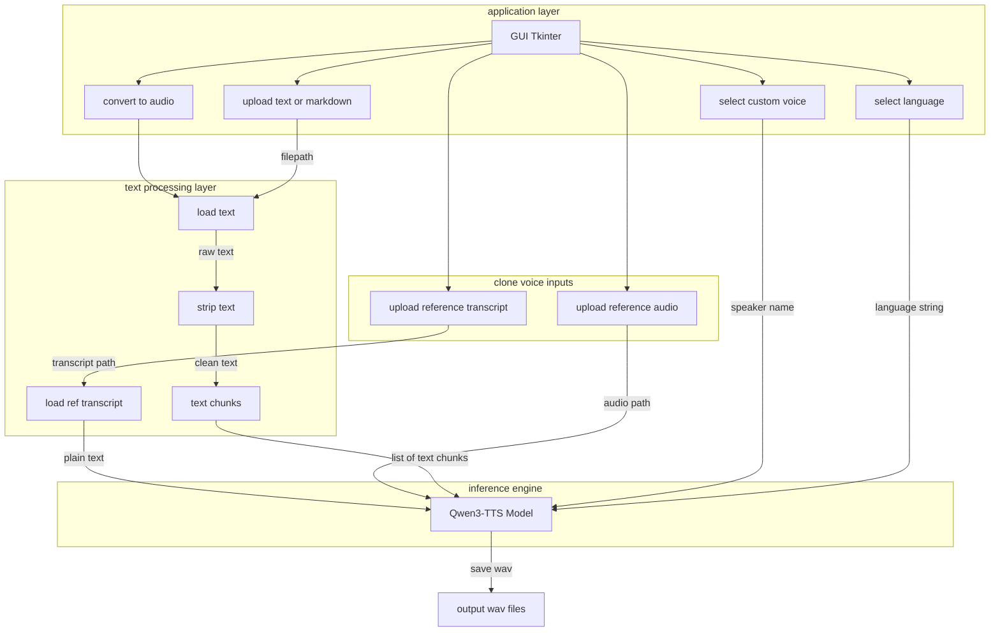
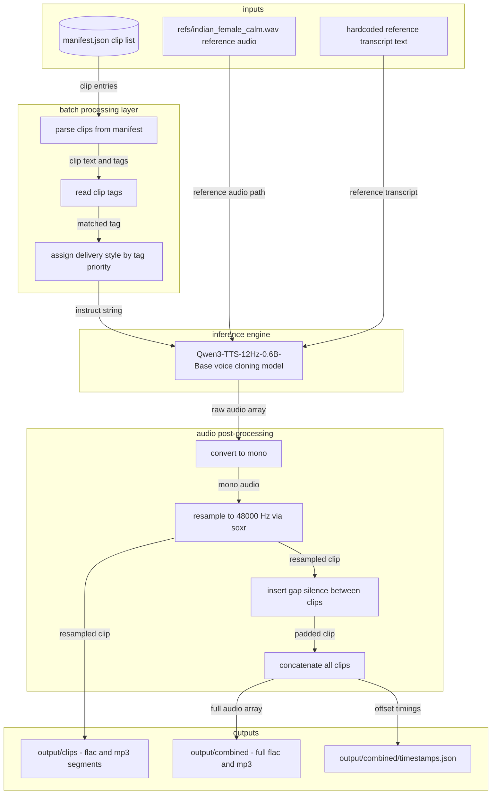

# TTS architecture

---

# Pre-development Architecture (Batch Synthesis Route)

> This pipeline was used before the desktop app was built. It is a standalone CLI script
> (`scripts/synthesize_manifest.py`) that batch-generates audio assets from a JSON manifest.

