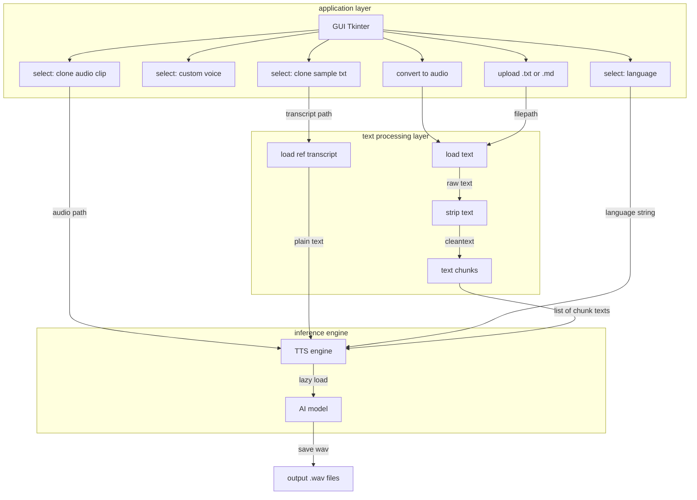

# TTS architecture

```mermaid
flowchart TD
subgraph ui["application layer"]
    gui["GUI Tkinter"]
    upload["upload .txt or .md"]
    customvoice["select: custom voice"]
    aupload["select: clone audio clip"]
    txtfile["select: clone sample txt"]
    lang["select: language"]
    convert["convert to audio"]
end

subgraph text["text processing layer"]
    load["load text"]  
    strip["strip text"]
    chunk["text chunks"]
    load_ref_txt["load ref transcript"]
end

subgraph engine["inference engine"]
    ttsengine["TTS engine"]
    aimodel["AI model"]
end

out["output .wav files"]


gui-->upload
gui-->customvoice
gui-->aupload
gui-->txtfile
gui-->lang
gui-->convert

convert-->load
upload-->|filepath|load
aupload-->|audio path|ttsengine
txtfile-->|transcript path|load_ref_txt
load_ref_txt-->|plain text|ttsengine
lang-->|language string|ttsengine

load-->|raw text|strip
strip-->|cleantext|chunk

chunk-->|list of chunk texts|ttsengine
ttsengine-->|lazy load|aimodel

aimodel-->|save wav|out


```