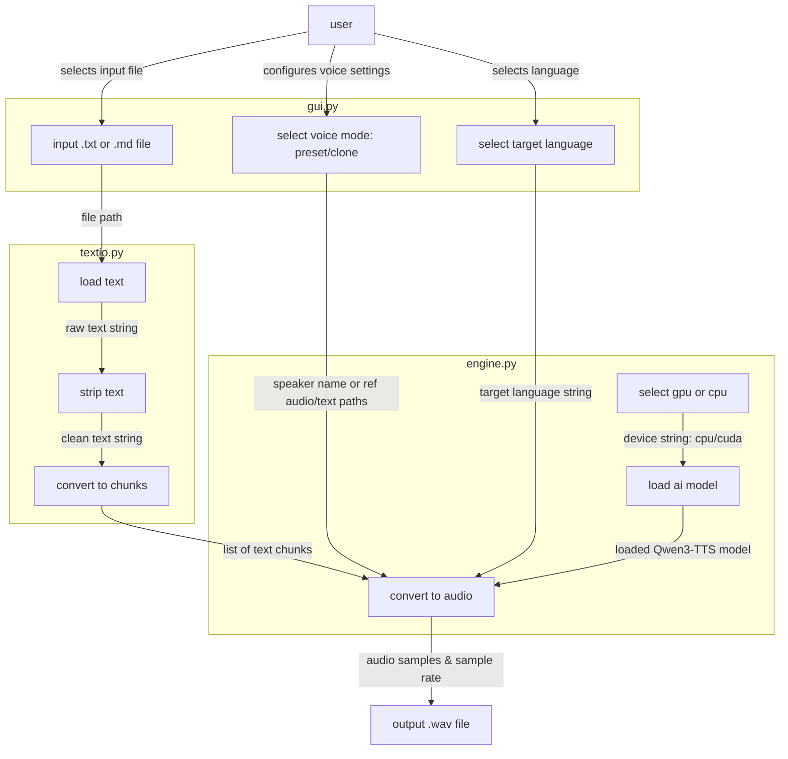

# tts data flow diagram

```mermaid
flowchart TD
user[user]
subgraph gui["gui.py"]
  input[input .txt or .md file]
  voice_settings[select voice mode: preset/clone]
  lang_setting[select target language]
end
subgraph textio["textio.py"]
  load[load text]
  strip[strip text]
  chunks[convert to chunks]
end
subgraph engine["engine.py"]
  device[select gpu or cpu]
  loadai[load ai model]
  convert[convert to audio]
end
wav[output .wav file]

%% Labeled Connections (Inputs/Outputs)
user -->|selects input file| input
user -->|configures voice settings| voice_settings
user -->|selects language| lang_setting

input -->|file path| load
load -->|raw text string| strip
strip -->|clean text string| chunks

chunks -->|list of text chunks| convert
voice_settings -->|speaker name or ref audio/text paths| convert
lang_setting -->|target language string| convert

device -->|device string: cpu/cuda| loadai
loadai -->|loaded Qwen3-TTS model| convert
convert -->|audio samples & sample rate| wav
```